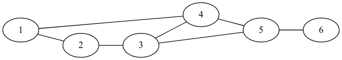

# Fighting with the gang of Billy the Kid

(Use this FileName pattern for submissions: __billykid__) 

Sheriff Pat is determined to fight with Billy the Kid and his gang.
In order to catch the gang he wants to locate his men, whom he trusts,
to several towns in New Mexico so that when he visits one of these
towns he can get intelligence about the gang.  He wants to be sure
that during any of his travels in New Mexico visiting __n__ towns
(without any revisit to a town) he finds __at least one__ among these
__n__ towns where he has located a man from his team.  His aim is to
choose __minimum__ number of towns for locating his men considering
the human resources in his team.

## Input format:

An input file for LP systems contains the following facts:

- A fact `townsintravel(N)` specifying the number of towns in any
  travel of the Sheriff, i.e. the number _n_ stated above.  Note that
  any travel must contain __N__ towns with __no cycles__.

- A relation of `town(T)` facts indicating that there is a town with
  id __T__.

- A relation of `connected(K,L)` facts indicating that town __K__ is
  connected to town __L__ with a road.  Note that for two connected
  towns there is only one connected fact in the instance and the first
  argument needs not to be smaller than the second argument
  considering integer numbers as town ids.

## Output format:

The output should contain exactly one fact of the form `selected(S)`,
where __S__ is the minimum number of towns selected satisfying the
requirements.

## Example:

The following graph depicts the towns and roads among them for the
instances below.



### Instance 1

LP input (instance1.pl):

```
town(1).         
town(2).         
town(3).         
town(4).         
town(5).         
town(6).         
                 
connected(1,4).  
connected(1,2).  
connected(2,3).  
connected(3,4).  
connected(3,5).  
connected(4,5).  
connected(5,6).  
                 
townsintravel(3).
```

Output:

```
selected(2)
```
                              
Sheriff's men are located to towns 3 and 4.

### Instance 2

LP input (instance2.pl):

```
town(1).
town(2).
town(3).
town(4).
town(5).
town(6).

connected(1,4).
connected(1,2).
connected(2,3).
connected(3,4).
connected(3,5).
connected(4,5).
connected(5,6).
              
townsintravel(5).
```

Output:

```
selected(1)
```
                             
Sheriff's man is located to town 5                     

