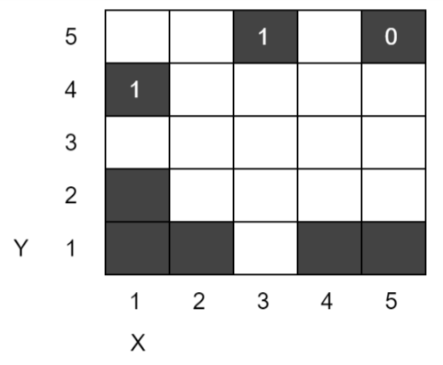
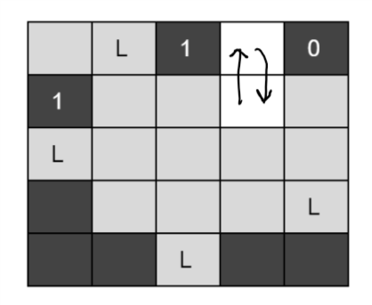
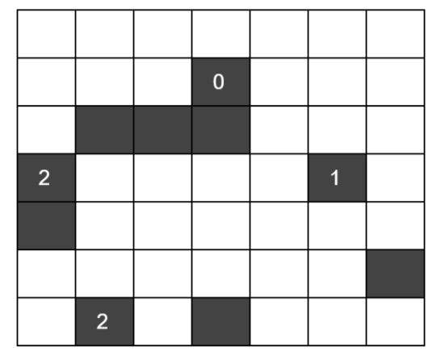
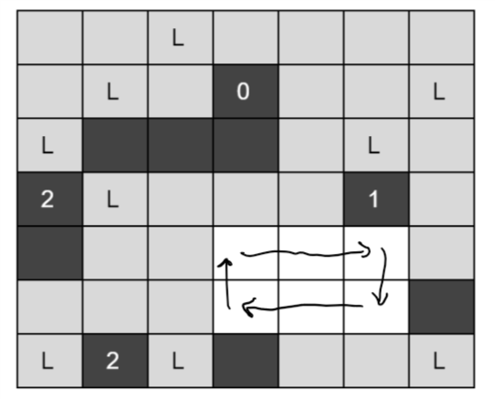

# Smarty Road Runner

(Use this FileName pattern for submissions: __roadrunner__) 

Wile E. Coyote wants to catch the Road Runner. This time he orders the
laser kit from Acme hoping to fry the Road Runner with a laser. The
laser kit comes with some laser systems to be installed and a
grid-based map of the desert. Each cell in the grid is either an open
area (shown as while cells) or a hill (shown as black cells). In order
to use the laser kit, one must place laser systems to some cells of
open areas.

Below is an example 5x5 map of the desert.



Here are the rules in the manual of the kit.

- A laser system can only be installed in a cell of open area.

- When the system operates, each laser system fires up laser in all
  four quadrantal directions (up, down, left and right).  A laser beam
  shines until it hits a hill or arrives an edge of the desert.

- Any two laser systems must not fire lasers to each other.

- Some black cells have numbers (0,1,2,3, or 4) that show the total
  number of laser systems that must be installed in the four
  quadrantal neighbouring cells of the corresponding black cell.

Our smarty Road Runner gets the Acme package before it arrives to the
Coyote.  He opens the box and fills up the map by placing the laser
systems on the map.  But, he places the laser systems in a way that
rules of the kit are obeyed and still some cells are left safe from
laser. __All the safe cells must form one closed circuit__ for the
Road Runner to run safely, i.e., the Road Runner can start running in
one safe cell, follow adjecent safe cells (in up, down, left or right
direction) and arrive at the starting position traveling all safe
cells without visiting any one twice.

Your task is to help the Road Runner by finding a solution of the map
that leads __the path length of the circuit__ formed by the safe cells
is __maximum__ (Note that only one safe cell forms a trivial circuit
of length 1).

For example, the below map show the solution for the mentioned 5x5
map.  The cells marked with L are the ones that has a laser system.
The cells attacked by laser beams are shown as gray cells.  The white
cells are safe areas and the arrows show the maximum length closed
circuit that our Road Runner runs on.  The length of the circuit is 2.



## Input format:

An input file for LP systems contains the following facts:

- A relation of `xcoord(X)` and `ycoord(Y)` facts indicating the __X__
  and __Y__ coordinates of the map, respectively.  Note that the
  left-bottom cell has (1,1) as coordinates and right-top cell has
  (N,M) where N and M are maximum X and Y coordinates, respectively,
  defined by xcoord and ycoord instances.

- A relation of `hill(X,Y)` facts indicating the __X__ and __Y__
  coordinates of the hills in the map.

- A relation of `number(X,Y,N)` facts indicating that the hill at
  __(X,Y)__ has the number __N__ on it.

## Output format:

The output should contain exactly one fact of the form
`safecircuitlen(L)`, where __L__ is the maximum path length of the
safe circuit satisfying the requirements.

## Example:

The first instance is for the 5x5 map mentioned above.  Additionally,
the below figures show the map and the solution of the second given
instance.





### Instance 1

LP input (instance1.pl):

```
xcoord(1). xcoord(2). xcoord(3).
xcoord(4). xcoord(5).           
ycoord(1). ycoord(2). ycoord(3).
ycoord(4). ycoord(5).           
                                
hill(5,1). hill(1,2). hill(4,1).
hill(1,1). hill(2,1). hill(5,5).
hill(3,5). hill(1,4).           
                                
number(5,5,0).  number(3,5,1).  
number(1,4,1).                  
```

Output:

```
safecircuitlen(2)
```

### Instance 2

LP input (instance3.pl):

```
xcoord(1).  xcoord(2).  xcoord(3).
xcoord(4).  xcoord(5).  xcoord(6).
xcoord(7).                        
ycoord(1).  ycoord(2).  ycoord(3).
ycoord(4).  ycoord(5).  ycoord(6).
ycoord(7).                        
                                  
hill(4,5).  hill(4,1).  hill(1,3).
hill(2,5).  hill(7,2).  hill(3,5).
hill(4,6).  hill(1,4).  hill(6,4).
hill(2,1).                        
                                  
number(4,6,0).  number(1,4,2).    
number(6,4,1).  number(2,1,2).    
```

Output:

```
safecircuitlen(6)
```

